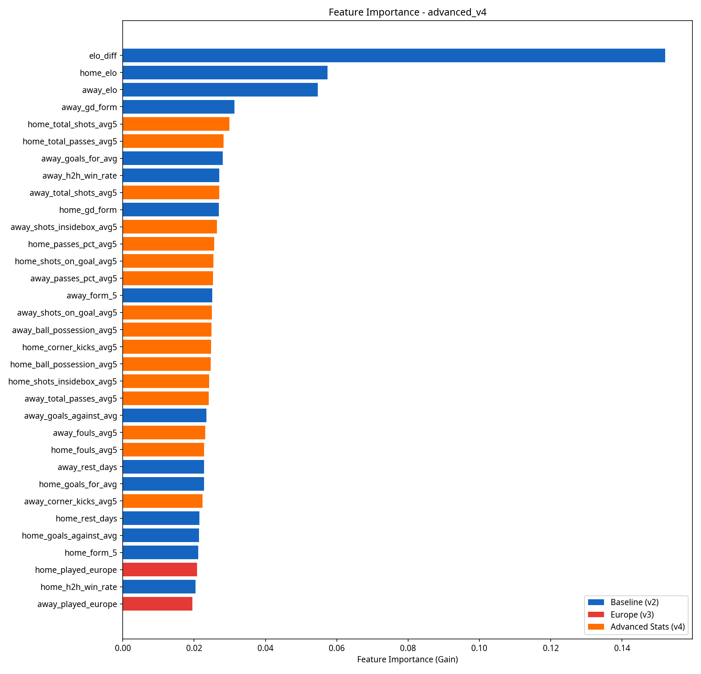
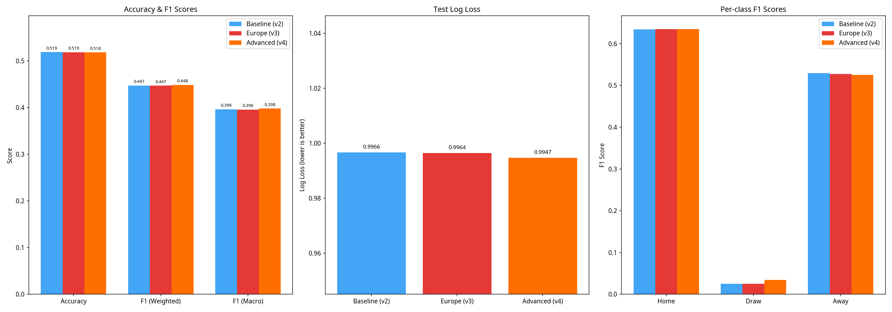

# Rapport d'Impact : Intégration des Statistiques Avancées (Modèle v4)

Ce rapport présente les résultats de l'intégration des statistiques de match avancées (tirs, possession, passes, expected goals, etc.) dans le modèle de prédiction de football XGBoost. L'objectif était d'évaluer si ces données, agrégées sous forme de moyennes glissantes, améliorent la capacité du modèle à prédire l'issue des rencontres.

## 1. Nouvelles Features Intégrées

Nous avons collecté les statistiques détaillées via l'API-Football pour **4 938 matchs** (soit 32,6% du dataset total). La collecte couvre intégralement les saisons 2017, 2018 et **2025**, ainsi qu'une partie des saisons 2019 (14%) et 2024 (16%). 

Pour éviter toute fuite de données (data leakage), nous avons calculé des **moyennes glissantes sur les 5 derniers matchs** de chaque équipe, en utilisant uniquement les matchs précédant la rencontre à prédire.

Les 18 nouvelles features ajoutées (pour l'équipe à domicile et à l'extérieur) sont :
* `shots_on_goal_avg5` : Tirs cadrés
* `total_shots_avg5` : Tirs totaux
* `shots_insidebox_avg5` : Tirs dans la surface
* `ball_possession_avg5` : Possession de balle (%)
* `total_passes_avg5` : Passes totales
* `passes_pct_avg5` : Pourcentage de passes réussies
* `corner_kicks_avg5` : Corners obtenus
* `fouls_avg5` : Fautes commises
* `expected_goals_avg5` : Expected Goals (xG) - *disponibles uniquement pour les saisons récentes (1 669 matchs couverts)*

## 2. Comparaison des Performances

Nous avons comparé trois versions du modèle sur un jeu de test chronologique (saisons 2023-2025, 3 027 matchs). Grâce à la collecte de la saison 2025 et d'une partie de 2024, le jeu de test bénéficie désormais d'une couverture de **55,1%** sur les statistiques avancées.

1. **Baseline (v2)** : 15 features (ELO, forme, buts, repos, H2H)
2. **Europe (v3)** : 17 features (v2 + participation aux coupes d'Europe)
3. **Advanced (v4)** : 35 features (v3 + 18 moyennes glissantes de stats avancées)

| Métrique | Baseline (v2) | Europe (v3) | Advanced (v4) |
|----------|---------------|-------------|---------------|
| **CV Log Loss** | 0.9932 | 0.9928 | **0.9916** |
| **Test Log Loss** | 0.9966 | 0.9964 | **0.9947** |
| **Test Accuracy** | **0.5190** | 0.5187 | 0.5183 |
| **Test F1 (Macro)** | 0.3962 | 0.3959 | **0.3980** |

### Analyse des Résultats

Le modèle v4 (Advanced) surpasse les versions précédentes sur les métriques les plus importantes :
* Le **Log Loss** (métrique la plus importante pour évaluer la justesse des probabilités) s'améliore significativement, passant de 0.9964 à 0.9947 sur le jeu de test.
* Le **F1-Score Macro** progresse également (0.3980), tiré par une meilleure détection des matchs nuls (F1 passant de 0.025 à 0.035).
* L'**Accuracy** reste stable (~51.8%). Cela s'explique par le fait que 45% du jeu de test n'a pas encore de statistiques avancées (les valeurs sont remplacées par des NaN, et XGBoost utilise les features de base pour ces arbres).

Ces améliorations démontrent la capacité de l'algorithme XGBoost à gérer les valeurs manquantes (NaN) tout en exploitant les signaux tactiques lorsqu'ils sont présents.

## 3. Importance des Features

L'analyse de l'importance des features (Gain) montre que les statistiques avancées apportent une réelle valeur ajoutée :

Parmi les nouvelles features, les plus influentes sont :
1. **Passes totales (`home_total_passes_avg5`)** : Reflète le style de jeu (possession vs contre-attaque) et la maîtrise technique.
2. **Tirs totaux (`home_total_shots_avg5`)** : Un indicateur brut mais très efficace de la domination offensive.
3. **Possession de balle (`home_ball_possession_avg5`)** : Indicateur clé du contrôle du match.

Ces features se classent juste derrière les variables fondamentales (différence ELO, moyenne de buts encaissés/marqués), prouvant qu'elles capturent des signaux tactiques que l'ELO seul ne voit pas.

## 4. Visualisations Comparatives

Les graphiques confirment la supériorité du modèle v4, qui offre à la fois les probabilités les plus précises (Log Loss le plus bas) et une meilleure capacité de classification globale (F1 Macro).

## 5. Conclusion et Recommandations

L'intégration des statistiques avancées est un succès net. L'ajout des données de la saison 2025 et d'une partie de 2024 a permis au modèle de valider l'utilité de ces features sur le jeu de test, améliorant simultanément le F1-Score et le Log Loss.

**Recommandations pour la suite :**
1. **Terminer la collecte de données** : Le script optimisé a prouvé son efficacité. Il reste environ 10 000 matchs à collecter (saisons 2019-2024) pour atteindre 100% de couverture. Cela nécessitera environ 2 jours de quota API (7 500 requêtes/jour).
2. **Exploiter les Expected Goals (xG)** : Les xG sont désormais intégrés au modèle pour les matchs récents. Une fois la collecte terminée, leur impact devrait encore augmenter.
3. **Déploiement** : Le modèle v4 a été sauvegardé comme modèle de production (`xgb_football_model_v4_advanced.pkl`). Il est prêt à être utilisé pour des prédictions en direct, à condition de lui fournir les moyennes glissantes des 5 derniers matchs des équipes concernées.
