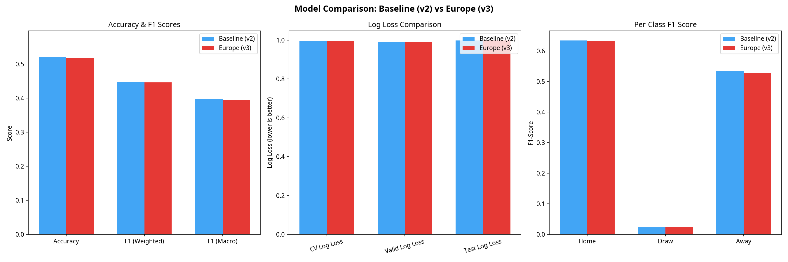

# Impact des Compétitions Européennes sur les Prédictions (Modèle v3)

## 1. Objectif et Méthodologie

L'objectif de cette mise à jour était d'évaluer si la participation d'une équipe à une compétition européenne (Ligue des Champions, Ligue Europa, Ligue Conférence) dans les jours précédant un match de championnat a un impact significatif sur ses performances, et si cette information peut améliorer la précision du modèle de prédiction XGBoost.

### Collecte des données
Nous avons utilisé l'API API-Football pour collecter l'historique complet des matchs des trois compétitions européennes majeures de la saison 2017/2018 à la saison 2025/2026 :
*   **Ligue des Champions (ID 2)**
*   **Ligue Europa (ID 3)**
*   **Ligue Conférence (ID 848)** (depuis sa création en 2021)

Au total, **6 945 matchs européens** ont été récupérés.

### Nouvelles Features
Deux nouvelles variables binaires ont été ajoutées au dataset principal (`football_matches.csv`) :
*   `home_played_europe` : Vaut 1 si l'équipe à domicile a joué un match européen dans les 7 jours précédant la rencontre, 0 sinon.
*   `away_played_europe` : Vaut 1 si l'équipe à l'extérieur a joué un match européen dans les 7 jours précédant la rencontre, 0 sinon.

Sur les 15 135 matchs du dataset, l'équipe à domicile avait joué en Europe dans 10,4% des cas, et l'équipe à l'extérieur dans 10,0% des cas. Dans 18,0% des matchs, au moins une des deux équipes était concernée.

## 2. Résultats et Comparaison (v2 vs v3)

Nous avons entraîné un nouveau modèle XGBoost (v3) avec ces 17 features et l'avons comparé au modèle de référence (v2, 15 features) sur le même jeu de test chronologique (saisons 2023 à 2025, soit 3 027 matchs).

### Métriques Globales

| Métrique | Baseline (v2) | Europe (v3) | Différence |
| :--- | :--- | :--- | :--- |
| **CV Log Loss** | 0.9931 | **0.9928** | -0.0003 (Léger gain) |
| **Validation Log Loss** | 0.9902 | **0.9896** | -0.0006 (Léger gain) |
| **Test Log Loss** | **0.9976** | 0.9982 | +0.0006 (Légère perte) |
| **Test Accuracy** | **52.00%** | 51.77% | -0.23 pts |
| **Test F1 (Macro)** | **0.3967** | 0.3953 | -0.0014 |

### Analyse par Classe (Jeu de Test)

| Classe | F1-Score (v2) | F1-Score (v3) | Évolution |
| :--- | :--- | :--- | :--- |
| **Victoire Domicile** | **0.6340** | 0.6333 | -0.0007 |
| **Match Nul** | 0.0228 | **0.0253** | +0.0025 |
| **Victoire Extérieur** | **0.5332** | 0.5273 | -0.0059 |

### Importance des Features

L'analyse de l'importance des variables (Gain) montre que les nouvelles features ont une importance modérée :
*   `away_played_europe` se classe en **10ème position** sur 17.
*   `home_played_europe` se classe en **17ème position** (dernière).

Les variables dominantes restent la différence d'ELO (`elo_diff`), l'ELO des deux équipes, et la forme récente (différence de buts).

## 3. Conclusion

L'ajout des variables indiquant si une équipe a joué en coupe d'Europe la semaine précédente **n'améliore pas significativement les performances globales du modèle**. 

Bien que l'on observe une très légère amélioration de la fonction de perte (Log Loss) lors de la validation croisée, les performances sur le jeu de test final sont marginalement inférieures (baisse de 0.23 point de précision). La seule amélioration notable concerne la prédiction des matchs nuls, mais le F1-score sur cette classe reste extrêmement faible (~0.025).

**Pourquoi cet impact limité ?**
1.  **Redondance de l'information** : La fatigue ou la baisse de forme liée aux matchs européens est probablement déjà captée par d'autres variables dynamiques très réactives, comme la forme sur les 5 derniers matchs (`home_form_5`, `home_gd_form`) ou les variations de l'ELO.
2.  **Rotation des effectifs** : Les équipes engagées en coupe d'Europe (souvent les meilleures équipes du championnat) ont des effectifs profonds et pratiquent le *turnover*, ce qui atténue l'impact de la fatigue sur le match de championnat suivant.

**Recommandation** : Le modèle v3 a été sauvegardé et le dataset mis à jour, mais pour un déploiement en production, le modèle v2 (sans ces features) reste légèrement plus robuste et plus simple à maintenir (moins d'appels API nécessaires).
